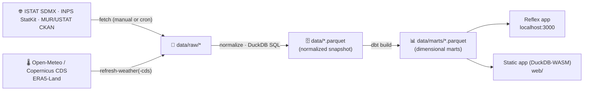

<div align="center">

# 🇮🇹 Italy Dashboard

**Explore official Italian statistics — crime, population, labor, economy, education,
and climate — in one place.**

ISTAT · INPS · MUR/USTAT · Open-Meteo/Copernicus · no API keys required


*Crime page rendered with synthetic sample data.*

</div>

---

## ✨ What it does

| Page | What you see |
| --- | --- |
| 🏠 **Home** | KPI tiles: reported crimes, resident population, unemployment, inflation |
| 🚨 **Crime** | Alleged offenders (police reports, incl. citizenship + per-capita rates) and convictions — interactive explorer *(primary focus)* |
| 👥 **Population** | Residents and foreign-residents share, by region |
| 💼 **Labor** | Unemployment rate (ISTAT) plus NASPI unemployment-benefit recipients (INPS), by region |
| 💶 **Economy** | Consumer-price inflation, year by year |
| 🎓 **Education** | University scholarships granted (Diritto allo Studio Universitario), by region — MUR/USTAT |
| 🌡️ **Climate** *(beta)* | Daily temperature by province capital, 1950–present — Open-Meteo/Copernicus ERA5-Land |
| 🚨×🌡️ **Climate × Crime** *(beta)* | Ecological correlation between summer heat and violent-offender rates |

> [!NOTE]
> **Climate and Climate × Crime are beta.** The temperature backfill (106 province
> capitals, 76 years) is still in progress — both pages surface their current
> coverage rather than presenting a partial snapshot as complete. See
> [Datasets](docs/04-datasets.md#weather_daily-temperature-non-istat) for status.

Everything is Python: the primary UI is a [Reflex](https://reflex.dev) app (compiled
to a React frontend + FastAPI backend); a second, independent static frontend
(`web/`, TypeScript + DuckDB-WASM) queries the same Parquet marts entirely in the
browser, no backend at all. Both read the same local snapshot. The Reflex app is
bilingual — switch between English and Italian from the navbar (EN · IT); the
static frontend is English-only today (see [below](#the-static-frontend-web)).

## 🏗️ How it works

**Snapshot-first by design.** Neither frontend calls a live API at page load: a
fetch step downloads and normalizes each source locally, dbt builds analysis-ready
marts, and the apps read only the local Parquet snapshot. Pages stay fast, upstream
downtime doesn't matter, and it works offline once fetched.



| Path | Role |
| --- | --- |
| `ingestion/` | Fetch CLI + per-provider clients: `sdmx_client.py` (ISTAT), `inps_client.py`, `ustat_client.py`, `openmeteo.py`/`cds.py` (climate) |
| `ingestion/registry.yaml` | One entry per registry-driven dataset: provider, dataflow ID, filters, column mapping |
| `dbt/` | Staging + dimensional marts (crime, offenders, population, labor, education, climate), tests, seeds |
| `italy_dashboard/` | Reflex app: pages, state, DuckDB query layer, i18n, theme |
| `web/` | Static frontend: plain React + Observable Plot, DuckDB-WASM queries, hash routing |
| `shared/queries/` | SQL shared verbatim by both frontends' query layers |

All registry-driven datasets share one normalized schema, so **adding a simple
dataset is a registry entry, not new code**:
`territory, territory_name, category, category_name, period, value`. Richer,
multi-dimensional datasets (crime, climate) are modeled in dbt instead — see
[Architecture](docs/02-architecture.md).

> [!NOTE]
> **Why a custom SDMX client instead of the `istatapi` package?**
> The `istatapi` package on PyPI (1.0.0) is hardcoded to ISTAT's decommissioned
> `sdmx.istat.it` endpoint and is effectively unmaintained, so it fails out of the box.
> Our client is ~150 lines against the current endpoint, with retries, timeouts, and
> explicit errors — small enough to own.

## 🚀 Quick start

**Requirements:** [uv](https://docs.astral.sh/uv/) (`brew install uv`) and
[just](https://github.com/casey/just) (`brew install just`). uv installs the right
Python automatically; Node is needed only for the static frontend (`web/`) — the
Reflex app fetches its own frontend toolchain on first run.

```bash
git clone https://github.com/montanarograziano/italy-dashboard
cd italy-dashboard
just setup     # uv sync: creates .venv and installs everything (incl. dev tools)
just sample    # instant synthetic data (fake numbers!)
just run       # → http://localhost:3000
```

First launch takes a couple of minutes while Reflex sets up its toolchain; later
starts are fast. No `just`? Every recipe is a one-liner you can run directly — see
the `justfile` (e.g. `uv run python -m ingestion.fetch sample`).

### The static frontend (`web/`)

An independent, backend-free build of the same dashboard, querying Parquet directly
in the browser via DuckDB-WASM. It mirrors the Reflex app's eight pages and colour
modes, but is **English-only**: there is no EN/IT toggle here, only the Reflex app's
navbar has one. Data labels (region/crime/offence names) are English in both
frontends regardless, since both come from ISTAT as fetched — see
[Dashboard: Language](docs/06-dashboard.md#language). Adding UI-string i18n to this
frontend would mean porting `italy_dashboard/translations.py` and building a second
toggle, which is a real feature, not a one-line change, so it's tracked as a gap
rather than done here.

```bash
cd web
npm install
npm run dev      # → http://localhost:5173, staging data automatically (predev hook)
```

## 📥 Getting real data

> [!IMPORTANT]
> Some `dataflow_id` values in `ingestion/registry.yaml` are placeholders marked
> `TODO confirm` — ISTAT renames and versions its dataflows. Confirm them once, then
> refreshing is a single command.

**1 · Find the real ID for an ISTAT dataset**

```bash
just discover "delitti"                 # crime
just discover "popolazione residente"   # population
just discover "stranieri"               # foreign residents
just discover "disoccupazione"          # unemployment
just discover "prezzi al consumo"       # inflation
```

**2 · Update** `dataflow_id` values in `ingestion/registry.yaml`

**3 · Fetch** everything, or one dataset while iterating:

```bash
just refresh
just refresh crime_offenders
```

INPS (NASPI) and MUR/USTAT (university scholarships) use their own clients, not
SDMX discovery — `just refresh labor_naspi_beneficiaries` /
`just refresh education_university_scholarships` fetch them directly. Climate is
separate again: `just refresh-weather` (Open-Meteo, day-to-day) or
`just refresh-weather-cds` (bulk Copernicus CDS backfill) — see
[Datasets](docs/04-datasets.md).

**4 · Fix column mappings if needed.** If a normalized column comes out NULL, the log
names it and lists the columns actually present — check the headers in
`data/raw/<dataset>.csv` and adjust the `columns` mapping in the registry.

Refreshing later needs no restart: the app reads the new snapshot on the next page load.

## 🌐 Deployment

Two public deployments of two different frontends — see
[Deployment](docs/12-deployment.md) for the full picture (routing, data-baking,
free-tier caveats).

- **Netlify — primary public demo:** <https://italy-dashboard.netlify.app>. The
  static frontend (`web/`), always-on, no cold start, no backend to keep warm.
  Built from `netlify.toml` against the `data/marts` snapshot committed on
  `main` at deploy time — so it can lag a few commits behind this checkout;
  see [Deployment](docs/12-deployment.md) for what's currently live there.
- **Render — secondary, full Reflex implementation:**
  <https://italy-dashboard.onrender.com>. A single Docker container (Caddy +
  the Reflex backend behind one port) demonstrating the server-driven Python
  app end to end. Free tier: expect cold starts and websocket drops on
  spin-down — read [Deployment](docs/12-deployment.md) before relying on it.

### Self-hosting

```bash
just refresh          # real data, or `just sample` for synthetic
just docker-build
just docker-serve     # → http://localhost:10000, single port (Caddy + backend)
```

There is no authentication because there is nothing to protect — every dataset
served is public. If you fork this to add non-public data, add your own auth layer
in front.

## 🔧 Troubleshooting

<details>
<summary><b>"No data snapshot found" banner</b></summary>

Run `just sample` (or `just refresh`), then reload the page.
</details>

<details>
<summary><b><code>Not found (404) — check the dataflow ID</code></b></summary>

The ID in `registry.yaml` is wrong or was renamed; re-run `discover`.
</details>

<details>
<summary><b><code>Expected CSV ... but got XML/HTML</code></b></summary>

The dataflow/key combination returned no data, or that flow doesn't support CSV; try
broadening the key or re-checking the ID.
</details>

<details>
<summary><b>Charts empty for one dataset only</b></summary>

Almost always a `columns` mapping mismatch — see step 4 of "Getting real data".
</details>

## 🛠️ Development

Tooling: **uv** (packaging + venv), **ruff** (lint + format), **pyrefly** (type
checking), **pytest** (tests). Everything runs through `just`:

| Command | What it does |
| --- | --- |
| `just check` | Lint + typecheck + tests — **what CI runs** (`.github/workflows/ci.yml`) |
| `just lint` / `just fix` | Check style · auto-fix and format |
| `just typecheck` / `just typecheck-web` | Pyrefly (Python) / `tsc` (the static frontend) |
| `just test` | Full offline suite (unit + integration, mocked APIs) |
| `just test-unit` / `just test-integration` | Just one layer |
| `just test-live` | Tests against the **real** ISTAT API (excluded by default) |
| `just test-conformance` | Python-vs-TypeScript query parity between the two frontends |
| `just provenance` | Verify the committed data snapshot (row counts, hashes, source/license) |
| `just compile` | Fast Reflex frontend compile check |
| `just docker-build` / `just docker-serve` | Build the container / build and run it locally |
| `just clean` | Remove caches and build artifacts |

### Testing layout

```
tests/
├── unit/            # per-provider clients (mocked transport), registry, normalize,
│                     # sample data, query layer
├── integration/      # full pipeline (mocked APIs → parquet → dbt → queries), Reflex pages
└── browser/          # Playwright: chart rendering, static-app conformance (opt-in extra)
```

The whole offline suite runs anywhere with no network — every provider is mocked at
the transport level. CI (`.github/workflows/ci.yml`) runs it, plus `just provenance`,
a static-frontend build/typecheck, and the browser suite, on every push and PR
(including from forks — read-only permissions, no secrets, nothing hits a live API).

### Notes

- **Reflex is pinned to 0.9.8** — it evolves quickly with breaking changes. After any
  bump, run `just compile` and `just check`.
- **Few dependencies by choice:** `reflex`, `duckdb`, `polars`, `httpx2`, `pyyaml`,
  `pydantic`, `dbt-duckdb`. No pandas.
- **Chart colors** live in `italy_dashboard/theme.py` (and `web/src/theme.ts` for the
  static app) and follow a validated colorblind-safe palette with a fixed slot order
  — don't add series colors ad hoc.
- **Data caveats:** see [Methodology](docs/07-methodology.md) — read it before
  quoting any number; ISTAT's provincial crime data lags roughly two years, and the
  climate marts are partial (see the beta note above).

## 📜 Data & licensing

**Code** is [MIT-licensed](LICENSE). **Data is not** — every provider keeps its own
terms, and a *data license* is a different thing from a *free-API usage cap*
(Open-Meteo's data is CC BY 4.0; its zero-cost API tier is non-commercial-only
and rate-capped). Full per-provider table, verified sources, and the
in-app-attribution gap: see [Datasets → Licensing](docs/04-datasets.md#licensing).
Run `just provenance` for a machine-readable manifest (source, license, row
count, SHA-256) of every file this repo ships.

## 🔗 Related projects

This dashboard doesn't try to be the only Italian open-data tool. For adjacent
questions, these do it better — links, not duplication:

- **[datocrimine.it](https://www.datocrimine.it)** — a dedicated crime observatory
  (reported-crime trends, perceived vs. actual insecurity, the "numero oscuro"
  under-reporting gap): deeper on crime specifically than this dashboard's Crime page.
- **[DoveVannoINostriSoldi](https://www.dovevannoinostrisoldi.com)**
  ([source](https://github.com/Italian-Builders-Org/DoveVannoINostriSoldi)) — public
  spending transparency (SIOPE, OpenCoesione, PNRR): a different slice of official
  Italian data than the statistics covered here.
- **[Cruscotto Italia](https://www.agid.gov.it/it/cruscotto-italia)** (AgID) — the
  government's own cross-source analytics dashboard, recomposing public
  administration data by ISTAT municipality code.
- **[onData](https://www.ondata.it)** — the civic-tech association behind
  [`opensdmx`](https://github.com/ondata/opensdmx), whose documented INPS StatKit
  protocol `ingestion/inps_client.py` is written against.

If the question is "how much public money went where" or "how much crime, in more
depth", those links answer it better than this dashboard growing to cover it too.

## 🗺️ Roadmap ideas

- [ ] Province-level drill-down with choropleth maps (Plotly + ISTAT boundary GeoJSON)
- [ ] Scheduled refresh + "data as of" indicator in the UI
- [ ] In-app attribution footer for CC BY / IODL sources (see Data & licensing above)
- [x] Per-capita crime rates (offenders joined with population by citizenship)
- [x] Dark mode
