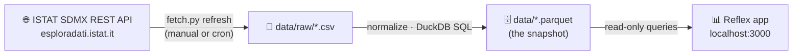

<div align="center">

# 🇮🇹 Italy Dashboard

**Explore official Italian statistics — crime, population, labor, and prices — in one place.**

Data from [ISTAT](https://www.istat.it) (Istituto Nazionale di Statistica) · no API keys required


*Crime page rendered with synthetic sample data.*

</div>

---

## ✨ What it does

| Page | What you see |
|---|---|
| 🏠 **Home** | KPI tiles: reported crimes, resident population, unemployment, inflation |
| 🚨 **Crime** | Alleged offenders (police reports, incl. citizenship + per-capita rates) and convictions — interactive explorer *(primary focus)* |
| 👥 **Population** | Residents and foreign-residents share, by region |
| 💼 **Labor** | Unemployment rate: selected region vs national average |
| 💶 **Economy** | Consumer-price inflation, year by year |

Everything is Python: the UI is a [Reflex](https://reflex.dev) app (compiled to a React
frontend + FastAPI backend); data lives in local Parquet snapshots queried through DuckDB.
The interface is bilingual — switch between English and Italian from the navbar (EN · IT).

## 🏗️ How it works

**Snapshot-first by design.** The dashboard never calls the ISTAT API at page load: a
fetch command downloads and normalizes datasets locally, and the app reads only the
local snapshot. Pages stay fast, ISTAT downtime doesn't matter, and it works offline.



| Path | Role |
|---|---|
| `ingestion/sdmx_client.py` | Thin async client (httpx2) for ISTAT's SDMX REST API |
| `ingestion/registry.yaml` | One entry per dataset: dataflow ID, filters, column mapping |
| `ingestion/fetch.py` | CLI: `discover` · `refresh` · `sample` |
| `ingestion/sample_data.py` | Synthetic data generator for development (clearly fake numbers) |
| `italy_dashboard/queries.py` | DuckDB read layer — the only code that touches the database |
| `italy_dashboard/state.py` | Reflex state: one substate per page |
| `italy_dashboard/pages/` | Home · Crime · Population · Labor · Economy |
| `italy_dashboard/theme.py` | Chart palette (colorblind-safe, fixed slot order) |

All datasets share one normalized schema, so **adding a dataset is a registry entry,
not new code**: `territory, territory_name, category, category_name, period, value`.

> [!NOTE]
> **Why a custom SDMX client instead of the `istatapi` package?**
> The `istatapi` package on PyPI (1.0.0) is hardcoded to ISTAT's decommissioned
> `sdmx.istat.it` endpoint and is effectively unmaintained, so it fails out of the box.
> Our client is ~150 lines against the current endpoint, with retries, timeouts, and
> explicit errors — small enough to own.

## 🚀 Quick start

**Requirements:** [uv](https://docs.astral.sh/uv/) (`brew install uv`) and
[just](https://github.com/casey/just) (`brew install just`). uv installs the right
Python automatically; Node is *not* needed — Reflex fetches its own frontend toolchain
on first run. Network access to `esploradati.istat.it` only when refreshing data.

```bash
cd italy-dashboard
just setup     # uv sync: creates .venv and installs everything (incl. dev tools)
just sample    # instant synthetic data (fake numbers!)
just run       # → http://localhost:3000
```

First launch takes a couple of minutes while Reflex sets up its toolchain; later starts
are fast. No `just`? Every recipe is a one-liner you can run directly — see the
`justfile` (e.g. `uv run python -m ingestion.fetch sample`).

## 📥 Getting real ISTAT data

> [!IMPORTANT]
> The dataflow IDs shipped in `ingestion/registry.yaml` are placeholders marked
> `TODO confirm` — ISTAT renames and versions its dataflows. Confirm them once, then
> refreshing is a single command.

**1 · Find the real ID for each dataset**

```bash
just discover "delitti"                 # crime
just discover "popolazione residente"   # population
just discover "stranieri"               # foreign residents
just discover "disoccupazione"          # unemployment
just discover "prezzi al consumo"       # inflation
```

**2 · Update** `dataflow_id` values in `ingestion/registry.yaml`

**3 · Fetch** everything, or one dataset while iterating:

```bash
just refresh
just refresh crime_reported
```

**4 · Fix column mappings if needed.** If a normalized column comes out NULL, the log
names it and lists the columns actually present — check the headers in
`data/raw/<dataset>.csv` and adjust the `columns` mapping in the registry. SDMX-CSV
headers vary per dataflow; expect one round of adjustment on first setup.

💡 `key: ALL` downloads a whole dataflow, which can be large. Once IDs are confirmed,
narrow the `key` (SDMX dotted dimension syntax) per dataset.

Refreshing later needs no restart: the app reads the new snapshot on the next page load.

## 🐳 Deployment (internal)

```bash
docker build -t italy-dashboard .
docker run -p 3000:3000 -p 8000:8000 -v $(pwd)/data:/app/data italy-dashboard
```

Mount `data/` from the host so snapshots survive restarts, and refresh from the host
(a nightly cron running `python -m ingestion.fetch refresh` works well). The image bakes
sample data as a fallback so it starts non-empty.

> [!WARNING]
> The dashboard has **no authentication** — keep it on an internal network or behind a
> reverse proxy with auth.

## 🔧 Troubleshooting

<details>
<summary><b>"No data snapshot found" banner</b></summary>

Run `just sample` (or `just refresh`), then reload the page.
</details>

<details>
<summary><b><code>Not found (404) — check the dataflow ID</code></b></summary>

The ID in `registry.yaml` is wrong or was renamed; re-run `discover`.
</details>

<details>
<summary><b><code>Expected CSV ... but got XML/HTML</code></b></summary>

The dataflow/key combination returned no data, or that flow doesn't support CSV; try
broadening the key or re-checking the ID.
</details>

<details>
<summary><b>Charts empty for one dataset only</b></summary>

Almost always a `columns` mapping mismatch — see step 4 of "Getting real ISTAT data".
</details>

## 🛠️ Development

Tooling: **uv** (packaging + venv), **ruff** (lint + format), **pyrefly** (type
checking), **pytest** (tests). Everything runs through `just`:

| Command | What it does |
|---|---|
| `just check` | Lint + typecheck + tests — **what CI runs** (`.github/workflows/ci.yml`) |
| `just lint` / `just fix` | Check style · auto-fix and format |
| `just typecheck` | Pyrefly type check |
| `just test` | Full offline suite (unit + integration, mocked API) |
| `just test-unit` / `just test-integration` | Just one layer |
| `just test-live` | Tests against the **real** ISTAT API (excluded by default) |
| `just provenance` | Verify the committed data snapshot (row counts, hashes, source/license) |
| `just compile` | Fast Reflex frontend compile check |
| `just clean` | Remove caches and build artifacts |

### Testing layout

```
tests/
├── unit/            # SDMX client (mocked transport), registry, normalize, queries, sample data
└── integration/     # full pipeline (mocked API → parquet → DuckDB → query layer), Reflex pages
```

The whole suite is offline — the ISTAT API is mocked with `httpx2.MockTransport` — so
it runs anywhere in ~2 seconds. Live API tests exist but are opt-in (`just test-live`).

### Notes

- **Reflex is pinned to 0.9.8** — it evolves quickly with breaking changes. After any
  bump, run `just compile` and `just check`.
- **Few dependencies by choice:** `reflex`, `duckdb`, `polars`, `httpx2`, `pyyaml`,
  `pydantic`. No pandas.
- **Chart colors** live in `italy_dashboard/theme.py` and follow a validated
  colorblind-safe palette with a fixed slot order — don't add series colors ad hoc, and
  keep multi-series charts within the first three slots.
- **Data caveat:** ISTAT's provincial crime data is published with a lag of roughly two
  years.

## 🗺️ Roadmap ideas

- [ ] Province-level drill-down with choropleth maps (Plotly + ISTAT boundary GeoJSON)
- [ ] Scheduled refresh + "data as of" indicator in the UI
- [x] Per-capita crime rates (offenders joined with population by citizenship)
- [ ] Dark mode (palette dark steps already defined in the design reference)
