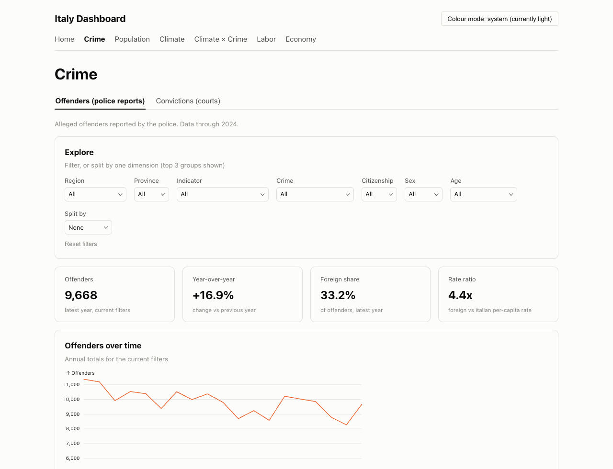
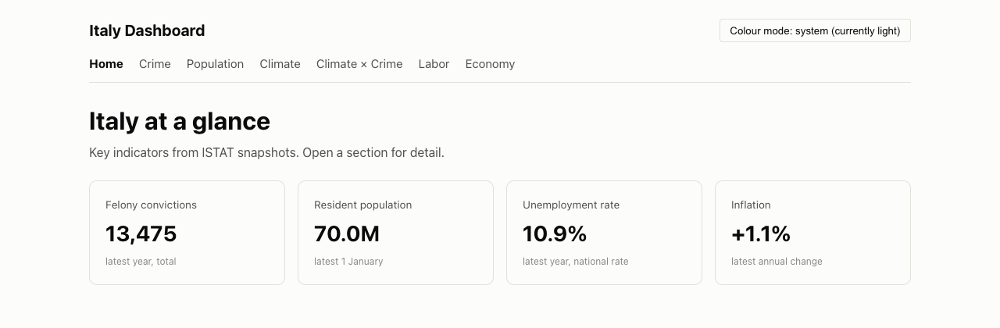
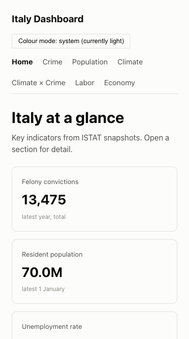
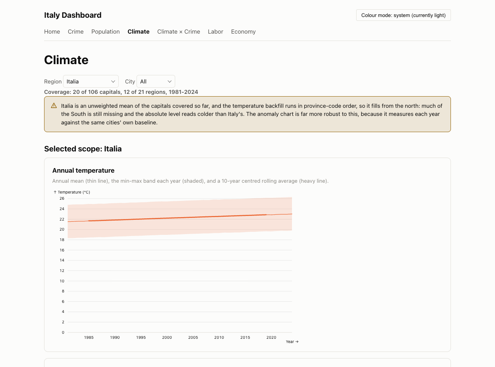
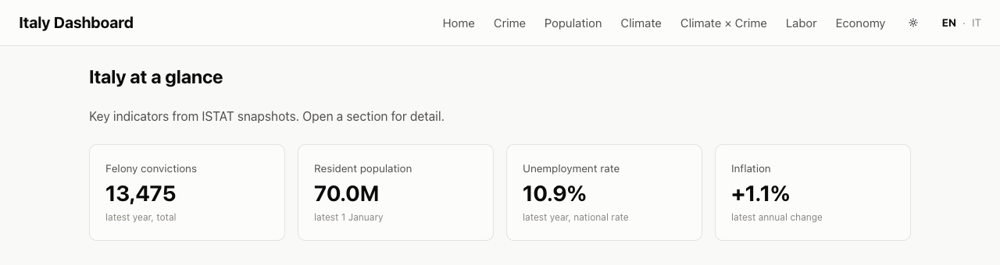
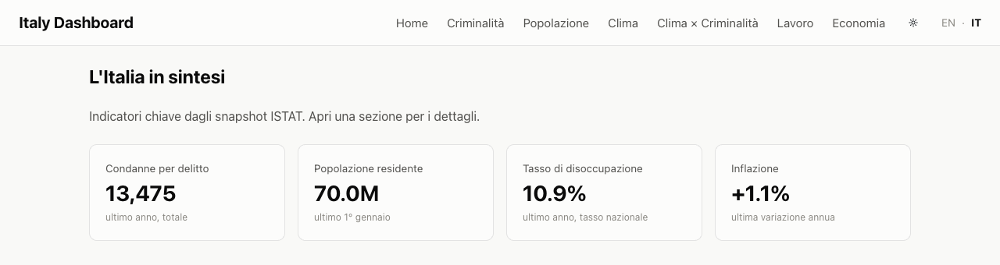
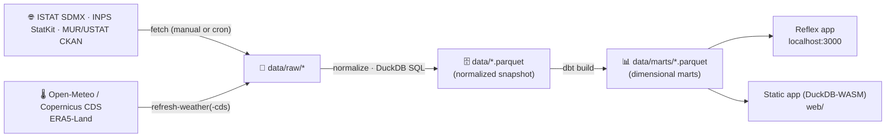

<div align="center">

# 🇮🇹 Italy Dashboard

**Verified Italian public statistics you can check for yourself: crime, population, labor,
economy, education, and climate.**

ISTAT · INPS · MUR/USTAT · Open-Meteo/Copernicus · no API keys, no accounts, no tracking


[](https://italy-dashboard.netlify.app)
[](https://italy-dashboard.onrender.com)

<a href="https://italy-dashboard.netlify.app">

</a>

*Live screenshot, not a mockup: [italy-dashboard.netlify.app](https://italy-dashboard.netlify.app), taken from the primary public demo.*

**🇬🇧 [Read in English ↓](#english) &nbsp;·&nbsp; 🇮🇹 [Leggi in italiano ↓](#italiano)**

</div>

---

## English

Numbers about crime, immigration, or unemployment get repeated a lot in Italy: by a
friend, on the evening news, in a newspaper, by a politician. The source is rarely
attached, and when it is, checking it usually means finding the right agency, the
right dataset, and the right definition, then hoping this year's figures are even
comparable to last year's. **Italy Dashboard exists to make that check take thirty
seconds instead of an afternoon**, and to make disagreeing with, correcting, or
extending the result just as easy as reading it.

**In this section:** [Why this exists](#why-this-exists) ·
[What you can check](#what-you-can-check) · [How it works](#how-it-works) ·
[Data sources and licensing](#data-sources-and-licensing) ·
[Getting started](#getting-started) · [Verify it yourself](#verify-it-yourself) ·
[Current limitations](#current-limitations) · [Related projects](#related-projects) ·
[Contributing and license](#contributing-and-license)

### Why this exists

This is not a claim that official statistics are wrong, or a tool built to win
arguments. It is the opposite bet: that most public numbers about Italy are
genuinely available, genuinely free, and genuinely checkable, and that the reason
they rarely get checked is friction, not secrecy. So every chart here traces back
to a named source (ISTAT, INPS, MUR/USTAT, or Copernicus/Open-Meteo), a specific
dataflow or dataset ID, and a documented license, with the known traps in that
data written down next to it instead of smoothed over. Agree with what you find,
disagree with it, or spot something that looks off: the fetch code, the SQL, and
the methodology notes are all here, in the open, specifically so they can be read,
questioned, and improved. See [Contributing and license](#contributing-and-license)
for how.

### What you can check

| Page | What you see |
| --- | --- |
| 🏠 Home | KPI tiles: reported crimes, resident population, unemployment, inflation |
| 🚨 Crime | Alleged offenders (police reports, incl. citizenship and per-capita rates) and convictions, interactive explorer *(primary focus)* |
| 👥 Population | Residents and foreign-residents share, by region |
| 💼 Labor | Unemployment rate (ISTAT) plus NASPI unemployment-benefit recipients (INPS), by region |
| 💶 Economy | Consumer-price inflation, year by year |
| 🎓 Education | University scholarships granted (Diritto allo Studio Universitario), by region: MUR/USTAT |
| 🌡️ Climate *(beta)* | Daily temperature by province capital, 1950 to present: Open-Meteo/Copernicus ERA5-Land |
| 🚨×🌡️ Climate × Crime *(beta)* | Ecological correlation between summer heat and violent-offender rates |




*Same app, no separate mobile build: [italy-dashboard.netlify.app](https://italy-dashboard.netlify.app) on desktop and on a phone-width viewport.*

> [!NOTE]
> **Climate and Climate × Crime are explicitly marked beta.** The temperature
> backfill (106 province capitals, 76 years) is still in progress, and the pages
> say so on screen rather than presenting a partial snapshot as a finished one:



*The coverage line and the warning are live numbers from the running app, not text
written into this README: see [Datasets](docs/04-datasets.md#weather_daily-temperature-non-istat)
for the current backfill status.*

Everything is Python: the primary UI is a [Reflex](https://reflex.dev) app (compiled
to a React frontend plus a FastAPI backend), and a second, independent static
frontend (`web/`, TypeScript and DuckDB-WASM) queries the same Parquet marts
entirely in the browser, no backend at all. Both read the same local snapshot.

**One codebase, two languages, honestly scoped.** The Reflex app's navbar has a
live **EN · IT** toggle that translates every UI label, KPI, and chart caption;
the preference persists in the browser. Data values themselves (region and
crime-category names) stay in English in both frontends regardless, since they
come straight from ISTAT's SDMX responses as fetched, not from the toggle, see
[Dashboard: Language](docs/06-dashboard.md#language). The static app (the
primary Netlify demo above) does not have the toggle at all yet: a full Italian
UI pass is tracked, not silently assumed.




*The secondary [Render deployment](https://italy-dashboard.onrender.com) switching
languages live, same session, same data.*

### How it works

**Snapshot-first by design.** Neither frontend calls a live API at page load: a
fetch step downloads and normalizes each source locally, dbt builds analysis-ready
marts, and the apps read only the local Parquet snapshot. Pages stay fast, upstream
downtime does not matter, and the whole thing works offline once fetched.



| Path | Role |
| --- | --- |
| `ingestion/` | Fetch CLI and per-provider clients: `sdmx_client.py` (ISTAT), `inps_client.py`, `ustat_client.py`, `openmeteo.py`/`cds.py` (climate) |
| `dbt/` | Staging and dimensional marts (crime, offenders, population, labor, education, climate), tests, seeds |
| `italy_dashboard/` | Reflex app: pages, state, DuckDB query layer, i18n, theme |
| `web/` | Static frontend: plain React, Observable Plot, DuckDB-WASM queries, hash routing |
| `shared/queries/` | SQL shared verbatim by both frontends' query layers, so a query cannot silently diverge between them |

Full write-up, including why a custom ~150-line SDMX client replaces the
unmaintained `istatapi` package: [Architecture](docs/02-architecture.md) and
[Data pipeline](docs/03-data-pipeline.md).

### Data sources and licensing

**Code** is [MIT-licensed](LICENSE). **Data is not:** every provider keeps its own
terms, verified against their current published pages, not assumed.

| Provider | Data license | Free-tier API |
| --- | --- | --- |
| [ISTAT](https://www.istat.it/it/note-legali) | CC BY 4.0 | SDMX REST, free and keyless |
| [MUR/USTAT](https://dati-ustat.mur.gov.it) | Italian Open Data License (IODL) 2.0 | CKAN API, free and keyless |
| INPS | Not documented for this endpoint, flagged rather than guessed | Free and keyless |
| [Open-Meteo](https://open-meteo.com/en/licence) | CC BY 4.0 on the underlying data | Non-commercial only, rate-capped |
| [Copernicus C3S ERA5-Land](https://cds.climate.copernicus.eu/datasets/reanalysis-era5-land) | CC BY 4.0 | Free for any use, requires a CDS account |

A data license and a free-API usage cap are two different axes: Open-Meteo's data
is CC BY 4.0, but its zero-cost API tier is non-commercial-only regardless. Full
table and the in-app-attribution gap: [Datasets → Licensing](docs/04-datasets.md#licensing).

### Getting started

Requirements: [uv](https://docs.astral.sh/uv/) (`brew install uv`) and
[just](https://github.com/casey/just) (`brew install just`).

```bash
git clone https://github.com/montanarograziano/italy-dashboard
cd italy-dashboard
just setup     # uv sync: creates .venv, installs everything
just sample    # instant synthetic data (fake numbers, clearly labeled as such)
just run       # -> http://localhost:3000
```

Want the real data instead of the sample set, or the browser-only static app
(`web/`)? Both are three commands away: [Getting started](docs/01-getting-started.md).

### Verify it yourself

This is the part that actually backs up the pitch above, so it gets a command,
not just a promise:

```bash
just provenance
```

This prints a machine-readable manifest, source, license, row count, and SHA-256,
for every file the committed data snapshot ships. If a number on a chart looks
wrong, the path to checking it is always the same: find its mart in
`shared/queries/` (the exact SQL both frontends run, not a black box), cross-check
the row count and hash against `just provenance`, then read
[Methodology and caveats](docs/07-methodology.md), which documents the ISTAT data
traps this pipeline has already hit (a hidden total row that doubled crime counts
one year, index series that reset at every rebasing, territory levels that
overcount when summed naively) and how the code guards against each one. Finding
a case that page does not cover is a legitimate, welcome
[issue](https://github.com/montanarograziano/italy-dashboard/issues) or PR.

### Current limitations

Said plainly, not buried:

- **Climate and Climate × Crime are beta.** Partial temperature coverage, stated
  on screen (see the screenshot above), not hidden in a footnote.
- **No in-app attribution footer yet.** CC BY 4.0 and IODL 2.0 both require visible
  credit where the data is *displayed*; this documentation carries it, the running
  UI does not yet. Tracked in [Roadmap](docs/11-roadmap.md).
- **The static app has no Italian UI yet;** see [How it works](#how-it-works) above.
- **Live deployments are snapshots, not live feeds.** Both the Netlify and Render
  URLs above serve whatever was last built and deployed; there is no
  scheduled auto-redeploy, so a page added in a recent commit can lag behind on a
  given deploy until the next manual rebuild. What is *in the repository* at any
  commit is the source of truth; see [Deployment](docs/12-deployment.md).
- **Render's free tier cold-starts and can drop idle websockets;** it is the
  secondary, server-driven reference deployment on purpose, not the one this
  project points people to first. Read [Deployment](docs/12-deployment.md) before
  relying on it for anything time-sensitive.
- **ISTAT's provincial crime data lags roughly two years,** and several series
  (foreign-resident denominators, NASPI, temperature) start well after 1950; exact
  coverage per dataset: [Datasets](docs/04-datasets.md).

### Related projects

This dashboard does not try to be the only Italian open-data tool. For adjacent
questions, these do it better, links, not duplication:

- **[datocrimine.it](https://www.datocrimine.it)**: a dedicated crime observatory
  (reported-crime trends, perceived vs. actual insecurity, the "numero oscuro"
  under-reporting gap), deeper on crime specifically than this dashboard's Crime page.
- **[DoveVannoINostriSoldi](https://www.dovevannoinostrisoldi.com)**
  ([source](https://github.com/Italian-Builders-Org/DoveVannoINostriSoldi)): public
  spending transparency (SIOPE, OpenCoesione, PNRR), a different slice of official
  Italian data than the statistics covered here.
- **[Cruscotto Italia](https://www.agid.gov.it/it/cruscotto-italia)** (AgID): the
  government's own cross-source analytics dashboard, recomposing public
  administration data by ISTAT municipality code.
- **[onData](https://www.ondata.it)**: the civic-tech association behind
  [`opensdmx`](https://github.com/ondata/opensdmx), whose documented INPS StatKit
  protocol `ingestion/inps_client.py` is written against.

### Contributing and license

Read [Contributing](CONTRIBUTING.md) first: this is a small, solo-maintained
project, and it says plainly what a useful PR looks like (a fixed dataflow ID, a
new registry-driven dataset, a bug fix with a regression test, a documentation
correction) versus what needs an issue first. Found a wrong number, a
misleading label, or a methodology choice you disagree with? That is exactly what
this project wants reported: open an [issue](https://github.com/montanarograziano/italy-dashboard/issues),
say what you expected and what you found. Security issue instead? See
[Security policy](SECURITY.md), please do not open a public issue for those.

Code is [MIT-licensed](LICENSE). Data is not, each provider keeps its own terms:
see [Data sources and licensing](#data-sources-and-licensing) above.

---

## Italiano

I numeri su criminalità, immigrazione o disoccupazione girano parecchio in
Italia: li cita un amico, il telegiornale, un giornale, un politico. La fonte
quasi mai c'è, e quando c'è, verificarla di solito significa trovare l'ente
giusto, il dataset giusto, la definizione giusta, e sperare che i dati di
quest'anno siano confrontabili con quelli dell'anno scorso. **Italy Dashboard
esiste per rendere questa verifica una questione di trenta secondi, non di un
pomeriggio**, e per rendere altrettanto facile essere in disaccordo, correggere
o ampliare il risultato.

**In questa sezione:** [Perché esiste](#perché-esiste) ·
[Cosa puoi verificare](#cosa-puoi-verificare) · [Come funziona](#come-funziona) ·
[Fonti dei dati e licenze](#fonti-dei-dati-e-licenze) · [Per iniziare](#per-iniziare) ·
[Verifica tu stesso](#verifica-tu-stesso) · [Limiti attuali](#limiti-attuali) ·
[Progetti correlati](#progetti-correlati) · [Contribuire e licenza](#contribuire-e-licenza)

### Perché esiste

Questo progetto non nasce per dire che le statistiche ufficiali sono sbagliate, né
per vincere discussioni. Nasce dalla scommessa opposta: che la maggior parte dei
numeri pubblici sull'Italia sia davvero disponibile, davvero gratuita e davvero
verificabile, e che il motivo per cui raramente vengono controllati sia l'attrito,
non la segretezza. Per questo ogni grafico qui dentro riporta una fonte precisa
(ISTAT, INPS, MUR/USTAT o Copernicus/Open-Meteo), un dataflow o un dataset
identificato, e una licenza documentata, con i limiti noti di quei dati scritti
accanto invece che nascosti. Che tu sia d'accordo con quello che trovi, in
disaccordo, o che tu noti qualcosa che non torna: il codice di raccolta dati, le
query SQL e le note di metodologia sono tutte qui, alla luce del sole, apposta
per essere lette, messe in discussione e migliorate. Come farlo:
[Contribuire e licenza](#contribuire-e-licenza).

### Cosa puoi verificare

La tabella completa delle pagine, con schermate, è nella sezione English qui
sopra: [What you can check](#what-you-can-check). In breve, il progetto copre
Home (indicatori chiave), Criminalità (denunce e condanne, la parte centrale del
progetto), Popolazione, Lavoro, Economia, Istruzione (borse di studio DSU) e,
in **beta**, Clima e Clima × Criminalità.

> [!NOTE]
> **Clima e Clima × Criminalità sono etichettate beta esplicitamente.** Il
> backfill delle temperature (106 capoluoghi di provincia, 76 anni) è ancora in
> corso, e le pagine lo dichiarano a schermo invece di presentare uno snapshot
> parziale come se fosse completo (vedi la schermata del banner di copertura
> nella sezione English sopra).

Tutto è Python: l'interfaccia principale è un'app [Reflex](https://reflex.dev)
(compilata in un frontend React più un backend FastAPI); un secondo frontend,
indipendente e statico (`web/`, TypeScript e DuckDB-WASM), interroga gli stessi
marts Parquet direttamente nel browser, senza alcun backend. Entrambi leggono lo
stesso snapshot locale.

**Un solo codice, due lingue, con i limiti dichiarati.** La navbar dell'app
Reflex ha un selettore **EN · IT** dal vivo che traduce ogni etichetta
dell'interfaccia, ogni KPI e ogni didascalia dei grafici; la preferenza resta
salvata nel browser. I valori dei dati (nomi di regioni e categorie di reato)
restano in inglese in entrambi i frontend, perché arrivano direttamente dalle
risposte SDMX di ISTAT così come raccolte, non dal selettore, vedi [Dashboard:
Language](docs/06-dashboard.md#language) (in inglese). L'app statica (la demo
principale su Netlify) non ha ancora nessun selettore di lingua: una
localizzazione italiana completa dell'interfaccia è nella roadmap, non data per
scontata.


*Il [deployment secondario su Render](https://italy-dashboard.onrender.com) che
cambia lingua dal vivo, stessa sessione, stessi dati.*

### Come funziona

**Snapshot-first per scelta di progetto.** Nessuno dei due frontend chiama
un'API live al caricamento della pagina: un passaggio di fetch scarica e
normalizza ogni fonte in locale, dbt costruisce marts pronti per l'analisi, e le
app leggono solo lo snapshot Parquet locale. Le pagine restano veloci, un disservizio
lato ISTAT non conta, e tutto funziona anche offline una volta scaricato.

Lo schema del flusso dati (fetch → normalizzazione → marts dbt → le due app) è
nella sezione English qui sopra: [How it works ↑](#how-it-works). In breve:

| Percorso | Ruolo |
| --- | --- |
| `ingestion/` | CLI di fetch e client per singolo fornitore (ISTAT, INPS, MUR/USTAT, Open-Meteo/CDS) |
| `dbt/` | Staging e marts dimensionali (criminalità, popolazione, lavoro, istruzione, clima) |
| `italy_dashboard/` | App Reflex: pagine, stato, livello query DuckDB, i18n, tema |
| `web/` | Frontend statico: React, Observable Plot, query DuckDB-WASM |
| `shared/queries/` | SQL condiviso alla lettera dai due frontend, così una query non può divergere in silenzio tra i due |

Approfondimento completo: [Architecture](docs/02-architecture.md) e
[Data pipeline](docs/03-data-pipeline.md) (documentazione tecnica, in inglese).

### Fonti dei dati e licenze

**Il codice** è con [licenza MIT](LICENSE). **I dati no:** ogni fornitore mantiene
i propri termini, verificati sulle pagine ufficiali attuali, non presunti.

| Fornitore | Licenza dei dati | API gratuita |
| --- | --- | --- |
| [ISTAT](https://www.istat.it/it/note-legali) | CC BY 4.0 | SDMX REST, gratuita e senza chiave |
| [MUR/USTAT](https://dati-ustat.mur.gov.it) | Italian Open Data License (IODL) 2.0 | API CKAN, gratuita e senza chiave |
| INPS | Non documentata per questo endpoint, segnalata invece che presunta | Gratuita e senza chiave |
| [Open-Meteo](https://open-meteo.com/en/licence) | CC BY 4.0 sui dati sottostanti | Solo uso non commerciale, con limiti di frequenza |
| [Copernicus C3S ERA5-Land](https://cds.climate.copernicus.eu/datasets/reanalysis-era5-land) | CC BY 4.0 | Gratuita per qualsiasi uso, richiede un account CDS |

Licenza dei dati e limiti dell'API gratuita sono due assi diversi: i dati
Open-Meteo sono CC BY 4.0, ma il livello gratuito della sua API resta comunque
solo per uso non commerciale. Tabella completa e il punto ancora aperto
sull'attribuzione in-app: [Datasets → Licensing](docs/04-datasets.md#licensing)
(in inglese).

### Per iniziare

Richiede [uv](https://docs.astral.sh/uv/) (`brew install uv`) e
[just](https://github.com/casey/just) (`brew install just`).

```bash
git clone https://github.com/montanarograziano/italy-dashboard
cd italy-dashboard
just setup     # uv sync: crea .venv e installa tutto
just sample    # dati sintetici, istantanei (numeri finti, dichiarati come tali)
just run       # -> http://localhost:3000
```

Per i dati reali, o per l'app statica che gira solo nel browser (`web/`), bastano
altri tre comandi: [Getting started](docs/01-getting-started.md) (in inglese).

### Verifica tu stesso

Questa è la parte che dà sostanza alla premessa, quindi è un comando, non solo
una promessa:

```bash
just provenance
```

Stampa un manifesto leggibile da macchina, fonte, licenza, numero di righe e
hash SHA-256, per ogni file dello snapshot dati committato. Se un numero in un
grafico sembra sbagliato, il percorso per verificarlo è sempre lo stesso: trova
il suo mart in `shared/queries/` (l'SQL esatto eseguito da entrambi i frontend,
non una scatola nera), confronta righe e hash con `just provenance`, poi leggi
[Methodology and caveats](docs/07-methodology.md) (in inglese), che documenta le
trappole dei dati ISTAT già incontrate e come il codice se ne difende. Trovare un
caso non coperto da quella pagina è un
[issue](https://github.com/montanarograziano/italy-dashboard/issues) o una PR
benvenuta, non un problema.

### Limiti attuali

Detti chiaramente, non nascosti:

- **Clima e Clima × Criminalità sono beta:** copertura parziale delle
  temperature, dichiarata a schermo (vedi la schermata sopra), non in una nota
  a piè di pagina.
- **Manca ancora un footer di attribuzione in-app:** CC BY 4.0 e IODL 2.0
  richiedono un credito visibile dove il dato è *mostrato*; questa
  documentazione lo riporta, l'interfaccia in esecuzione ancora no. Tracciato
  nella [Roadmap](docs/11-roadmap.md).
- **L'app statica non ha ancora un'interfaccia in italiano;** vedi
  [Come funziona](#come-funziona) sopra.
- **I deployment live sono snapshot, non flussi live.** Sia Netlify sia Render
  servono l'ultima build pubblicata; non c'è un redeploy automatico
  programmato, quindi una pagina aggiunta in un commit recente può non essere
  ancora nel deployment finché non viene ripubblicato a mano. La verità di
  riferimento è sempre il repository al commit corrente; vedi
  [Deployment](docs/12-deployment.md).
- **Il piano gratuito di Render ha cold start e può perdere websocket
  inattivi;** è il deployment secondario, di riferimento per la versione
  server-side, non quello consigliato per primo. Leggi
  [Deployment](docs/12-deployment.md) prima di farci affidamento per qualcosa
  di urgente.
- **I dati provinciali sulla criminalità ISTAT hanno un ritardo di circa due
  anni,** e diverse serie (residenti stranieri, NASPI, temperature) iniziano
  molto dopo il 1950; copertura esatta per dataset:
  [Datasets](docs/04-datasets.md).

### Progetti correlati

Questa dashboard non punta a essere l'unico strumento open data italiano. Per
domande adiacenti, questi progetti fanno meglio, un link, non una copia:

- **[datocrimine.it](https://www.datocrimine.it)**: un osservatorio dedicato
  alla criminalità (andamento delle denunce, insicurezza percepita vs reale, il
  "numero oscuro" della sommersione), più approfondito sulla criminalità della
  pagina Criminalità di questa dashboard.
- **[DoveVannoINostriSoldi](https://www.dovevannoinostrisoldi.com)**
  ([codice](https://github.com/Italian-Builders-Org/DoveVannoINostriSoldi)):
  trasparenza della spesa pubblica (SIOPE, OpenCoesione, PNRR), una fetta di
  dati ufficiali italiani diversa da quella coperta qui.
- **[Cruscotto Italia](https://www.agid.gov.it/it/cruscotto-italia)** (AgID): la
  dashboard analitica del governo stesso, che ricompone i dati della pubblica
  amministrazione per codice ISTAT del comune.
- **[onData](https://www.ondata.it)**: l'associazione civic-tech dietro
  [`opensdmx`](https://github.com/ondata/opensdmx), il cui protocollo INPS
  StatKit documentato è quello contro cui è scritto `ingestion/inps_client.py`.

### Contribuire e licenza

Leggi prima [Contributing](CONTRIBUTING.md) (in inglese): è un progetto piccolo,
mantenuto da una sola persona, e spiega chiaramente cosa rende utile una PR (un
dataflow ID corretto, un nuovo dataset guidato da registry, una correzione con
test di regressione, una correzione alla documentazione) e cosa invece merita
prima un issue. Hai trovato un numero sbagliato, un'etichetta fuorviante, o non
sei d'accordo con una scelta di metodologia? È esattamente il tipo di
segnalazione che questo progetto vuole: apri un
[issue](https://github.com/montanarograziano/italy-dashboard/issues), scrivi
cosa ti aspettavi e cosa hai trovato. Per una vulnerabilità di sicurezza, vedi
invece la [Security policy](SECURITY.md): non aprire un issue pubblico per
quelle.

Il codice è con [licenza MIT](LICENSE). I dati no, ogni fornitore mantiene i
propri termini: vedi [Fonti dei dati e licenze](#fonti-dei-dati-e-licenze) sopra.
