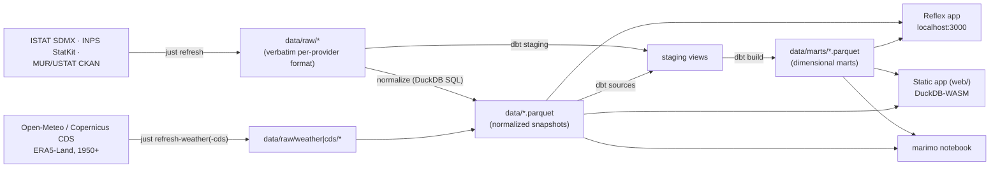

# Architecture

## The flow



## Design decisions and their reasons

**Parquet files are the snapshot — there is no database file.** Every consumer
(dashboard, notebook, tests) opens an in-memory DuckDB connection and creates
views over whatever `data/*.parquet` and `data/marts/*.parquet` exist at that
moment. Nothing stores absolute paths, so the same `data/` directory works on the
host, inside Docker, and in CI. This replaced an earlier design where a `.duckdb`
file persisted views with absolute host paths — which broke the moment Docker
mounted it.

**The runtime snapshots are committed; the rest are not.** `data/` was ignored
wholesale on the reasoning that any snapshot could be rebuilt with one command.
That stopped being true when temperature arrived: the weather backfill is days
of rate-limited fetching, so a lost snapshot is a lost week, and the deployment
builds from a clean clone where nothing regenerable is present anyway. So the
16 parquet files the running app actually queries are tracked (size scales
with whatever real or sample data is currently committed), and everything else
still is not: `data/raw/`, `data/dbt.duckdb`, and the dbt
inputs that only the transformation step reads, including
`data/weather_daily.parquet`. The container never runs dbt, it reads pre-built
marts, so shipping its inputs would be dead weight. Refreshing data is now a
commit, which is the cost of making the deployment reproducible.

**Two transformation paths, one owner each.** The generic `normalize` step in
`ingestion/` maps any ISTAT dataset onto a fixed 6-column schema
(`territory, territory_name, category, category_name, period, value`) — good
enough for single-dimension pages like labor or inflation. Rich, multi-dimensional
modeling (crime) lives in **dbt**, which reads the raw CSVs directly and preserves
every dimension. Adding a simple dataset is a registry entry; adding an analytical
mart is a dbt model.

**Missing data degrades, never crashes.** Datasets that haven't been fetched get
empty placeholder snapshots so dbt sources always resolve; the query layer returns
empty lists for missing views; the UI shows targeted callouts ("run `just refresh
income_regional`") instead of errors.

**The app is stateless with respect to data.** Refreshing data requires no app
restart — the next page load reads the new snapshot.

**`ingestion/` is no longer ISTAT-only.** NASPI comes from INPS (`inps_client.py`,
the StatKit hub middleware, not SDMX), university scholarships from MUR/USTAT
(`ustat_client.py`, CKAN), and temperature from Open-Meteo/Copernicus CDS
(`openmeteo.py`/`cds.py`), because none of these have an ISTAT equivalent at
the needed grain or at all. Every fetcher writes into the same normalized
output contract in `data/`, so everything downstream is unchanged regardless
of provider.

**Two independent frontends read the same marts.** `italy_dashboard/` is the
primary Reflex app (server-driven, Python end to end). `web/` is a second,
backend-free frontend (TypeScript + DuckDB-WASM) built for the Netlify static
deploy; it queries the exact same `data/marts/*.parquet` files, and both
frontends' SQL is kept in `shared/queries/` so a query can't silently diverge
between them (enforced by the conformance suite, `just test-conformance`).
See [Deployment](12-deployment.md) for which deployment serves which frontend.

## Repository layout

```
italy-dashboard/
├── ingestion/            # fetch CLI + per-provider clients, dataset registry, sample data
├── data/                 # snapshots: raw/ CSVs, *.parquet, marts/ (gitignored)
├── dbt/                  # dbt project: staging + marts + tests, seeds, profiles
├── italy_dashboard/      # Reflex app: pages, state, queries, i18n, theme
├── web/                  # static frontend: TypeScript + DuckDB-WASM (Netlify)
├── shared/queries/       # SQL shared verbatim by both frontends' query layers
├── notebooks/explore.py  # marimo data playground
├── tests/                # unit + integration + browser (offline except browser/)
├── docs/                 # this documentation (zensical)
├── justfile              # every workflow, one command each
└── pyproject.toml        # uv-managed; all tool configs
```

## Module boundaries

`ingestion/` knows about each provider's HTTP API but nothing about Reflex.
`italy_dashboard/` knows about DuckDB and Reflex but never touches the network.
`dbt/` sits between them, reading raw files and writing marts. If a provider
changes its API again, only its client in `ingestion/` moves; if the UI
framework changes, only `italy_dashboard/` (or `web/`, for the static frontend)
moves.
