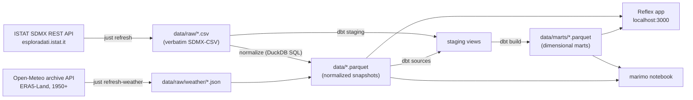

# Architecture

## The flow



## Design decisions and their reasons

**Parquet files are the snapshot — there is no database file.** Every consumer
(dashboard, notebook, tests) opens an in-memory DuckDB connection and creates
views over whatever `data/*.parquet` and `data/marts/*.parquet` exist at that
moment. Nothing stores absolute paths, so the same `data/` directory works on the
host, inside Docker, and in CI. This replaced an earlier design where a `.duckdb`
file persisted views with absolute host paths — which broke the moment Docker
mounted it.

**Two transformation paths, one owner each.** The generic `normalize` step in
`ingestion/` maps any ISTAT dataset onto a fixed 6-column schema
(`territory, territory_name, category, category_name, period, value`) — good
enough for single-dimension pages like labor or inflation. Rich, multi-dimensional
modeling (crime) lives in **dbt**, which reads the raw CSVs directly and preserves
every dimension. Adding a simple dataset is a registry entry; adding an analytical
mart is a dbt model.

**Missing data degrades, never crashes.** Datasets that haven't been fetched get
empty placeholder snapshots so dbt sources always resolve; the query layer returns
empty lists for missing views; the UI shows targeted callouts ("run `just refresh
income_regional`") instead of errors.

**The app is stateless with respect to data.** Refreshing data requires no app
restart — the next page load reads the new snapshot.

**`ingestion/` is no longer ISTAT-only.** Temperature comes from Open-Meteo,
because no ISTAT source has province-level climate before 2006. The two
fetchers share one output contract, write a parquet snapshot into `data/`, so
everything downstream is unchanged. `ingestion/openmeteo.py` is the HTTP
client, `ingestion/weather.py` the orchestration, mirroring the
`sdmx_client.py` / `fetch.py` split.

## Repository layout

```
italy-dashboard/
├── ingestion/            # fetch CLI, SDMX client, dataset registry, sample data
├── data/                 # snapshots: raw/ CSVs, *.parquet, marts/ (gitignored)
├── dbt/                  # dbt project: staging + marts + tests, profiles
├── italy_dashboard/      # Reflex app: pages, state, queries, i18n, theme
├── notebooks/explore.py  # marimo data playground
├── tests/                # unit + integration (115 tests, all offline)
├── docs/                 # this documentation (zensical)
├── justfile              # every workflow, one command each
└── pyproject.toml        # uv-managed; all tool configs
```

## Module boundaries

`ingestion/` knows about ISTAT and HTTP but nothing about Reflex. `italy_dashboard/`
knows about DuckDB and Reflex but never touches the network. `dbt/` sits between
them, reading raw files and writing marts. If ISTAT changes its API again, only
`ingestion/` moves; if the UI framework changes, only `italy_dashboard/` moves.
