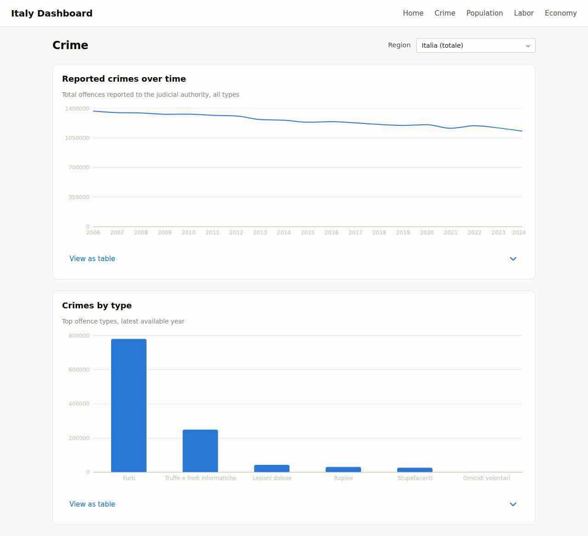

# Italy Dashboard

A bilingual (EN/IT) public dashboard for exploring official Italian statistics —
[ISTAT](https://www.istat.it), [INPS](https://www.inps.it), [MUR/USTAT](https://dati-ustat.mur.gov.it),
and [Open-Meteo/Copernicus](https://open-meteo.com) — with a primary focus on
**crime** (alleged offenders and convictions, sliceable by region, type of crime,
sex, age, and citizenship), alongside population, labor, economy, education, and
(beta) climate. Code is [MIT-licensed](https://github.com/montanarograziano/italy-dashboard/blob/main/LICENSE);
data keeps each provider's own terms — see [Datasets](04-datasets.md#licensing).

## What makes it more than a chart viewer

**Snapshot-first.** The app never calls the ISTAT API at page load. A fetch step
downloads raw data to local files; dbt transforms them into analysis-ready marts;
the dashboard reads only local Parquet. Fast pages, no dependency on ISTAT uptime,
fully offline once fetched.

**Modeled, not just displayed.** Crime data is normalized into dimensional marts
(year × region × crime × sex × age × citizenship) with explicit total-row flags,
so filters and splits aggregate correctly — including the honest comparisons:
offenders **per 1,000 residents of the same citizenship group**, foreign share
over time, and an income↔crime ecological correlation view.

**Skeptical by design.** ISTAT's published data has sharp edges — different
cross-tabulations in different years, mixed territory levels, rebased index
series. The pipeline encodes what we learned the hard way; the
[methodology page](07-methodology.md) documents every trap and how the code
avoids it.

## Stack at a glance

| Layer | Technology |
| --- | --- |
| Ingestion | Python + httpx2 against ISTAT SDMX, INPS StatKit, MUR/USTAT CKAN, Open-Meteo/CDS |
| Storage | Parquet snapshots, queried in-memory via DuckDB |
| Transformation | dbt (dbt-duckdb), marts materialized as Parquet |
| Dashboards | Reflex (pure-Python React) **and** a static TypeScript + DuckDB-WASM app (`web/`) |
| Exploration | marimo notebook: catalog, SQL playground, ad-hoc charts |
| Tooling | uv, just, ruff, pyrefly, pytest |

## Where to go next

- [Getting started](01-getting-started.md) — run the dashboard in three commands
- [Architecture](02-architecture.md) — how the pieces fit
- [Data pipeline](03-data-pipeline.md) — fetch, normalize, transform
- [Datasets](04-datasets.md) — every source, its provider, and its license
- [Methodology & caveats](07-methodology.md) — read this before quoting any number
- [Deployment](12-deployment.md) — GitHub Pages (the only hosted deployment) and running the Reflex app locally
